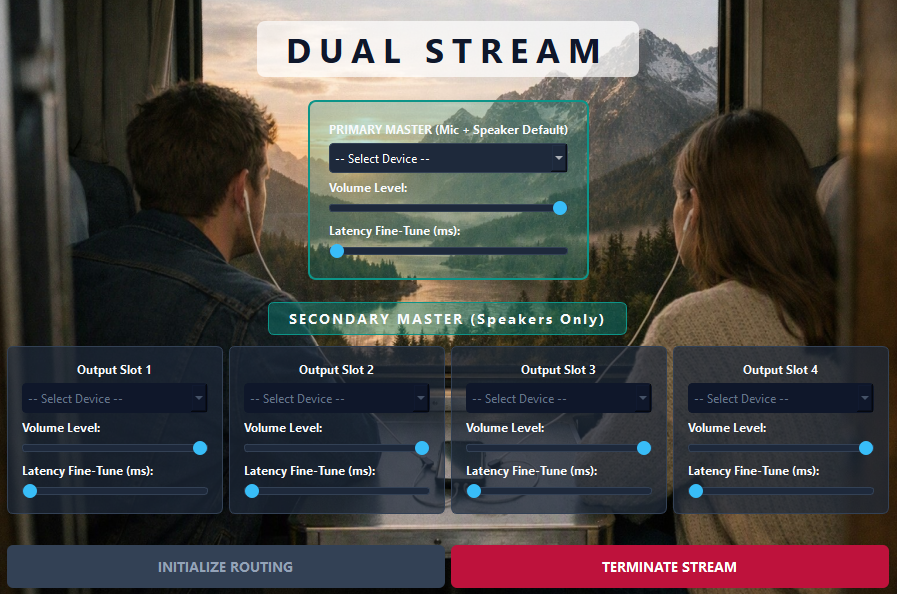

# Dual Stream 🎧
A highly sophisticated, pure software-level audio routing utility for laptops.

🌟 **Official Website & Download:** [Dual Stream Live](https://rj-rishabhjain.github.io/DualStream/)

  <!-- Custom Cinematic Audio Sharing Banner -->
  

 

  <!-- First Line: 3 Badges -->
  
  
  
  
    
  
  <!-- Second Line: 2 Badges -->
  
  

 

**Dual Stream** is a highly sophisticated, software-level audio routing utility. Operating purely as a single-device laptop configuration, it completely eliminates the need for secondary hardware routers. It empowers users to bypass standard OS limitations, simultaneously routing primary audio and microphone feeds to multiple secondary devices with extreme precision.

---

## ✨ Engineering Highlights

*   **Pure Software-Level Execution:** Functions entirely within your laptop's environment, requiring zero external routing hardware or complex cabling.
*   **Zero-Lag Asynchronous Pipeline:** Engineered with a multi-threaded worker pipeline to ensure instant UI rendering without Windows audio API freezes.
*   **Live Latency Control:** Features hardware-level buffer tuning and precise millisecond offset sliders for flawless acoustic synchronization across varied Bluetooth hardware.

---

## 📸 Dashboard Interface

> *(Advanced Engineering Dashboard UI)*
> 
> 

>   
> 

---

## 🚀 Installation & Usage

### 🪟 Windows (Available Now)
1. Download the `DualStream_Setup_v1.exe` from the Releases section.
2. Run the installer and launch the application.
3. Select your primary input/output devices and route them seamlessly.

### 🍏 macOS (In Development)
*   The `.dmg` release for Apple Silicon and Intel architectures is currently undergoing pipeline compilation via GitHub Actions.

---

## ☕ Support the Project

This tool is **100% Free and Open Source**. If this software optimized your audio workflow or helped you in a live environment, consider supporting the architecture!

---

## 👨‍💻 Developer
Built, engineered, and maintained by **Rishabh Jain**. 

## ⚖️ License
This project is protected under the [MIT License](LICENSE), making it free to use, modify, and distribute.